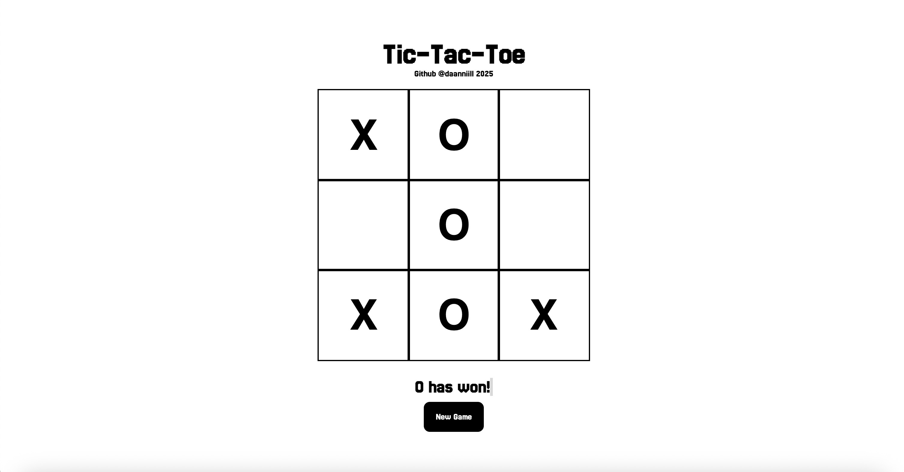

# Tic Tac Toe 🎮

A web-based **Tic Tac Toe** game built with **HTML, CSS, and JavaScript**.  
It features both **Easy (Random AI)** and **Impossible (Minimax AI)** modes, along with smooth animations and a clean UI.



---

## 🚀 Features
- 🎯 **Two AI Difficulties**:
- **Easy**: Opponent picks random moves.
- **Impossible**: AI uses the **minimax algorithm** for perfect play.
- 🖌️ **Clean UI & Animations** – smooth transitions when tiles appear.
- 🕹️ **Play Again button** for restarting quickly.
- 📱 Responsive and lightweight, runs in any browser.

---

## 📂 Project Structure
```
.
├── index.html     # Main HTML file
├── styles.css     # Game styling
├── scripts.js     # Game logic (AI, minimax, events)
├── preview.jpeg   # Screenshot of the game
└── README.md      # Project documentation
```

---

## 🏗️ How to Run
1. Clone the repository:
   ```bash
   git clone https://github.com/daanniill/tic-tac-toe.git
   ```
2. Open `index.html` in your browser.

That’s it — no extra setup needed!

---

## 💡 How It Works
- **Game Loop** is controlled by `Game()` in `scripts.js`.
- **Minimax AI** ensures unbeatable play on "Impossible" difficulty.
- **DOM Manipulation** dynamically creates the board and handles events.
- **Animations** are handled with CSS `@keyframes` for a polished feel.

---

## 📸 Preview
Here’s what the game looks like:


---

## 👤 Author
Made with ❤️ by **[daanniill](https://github.com/daanniill)**  
2025

---
